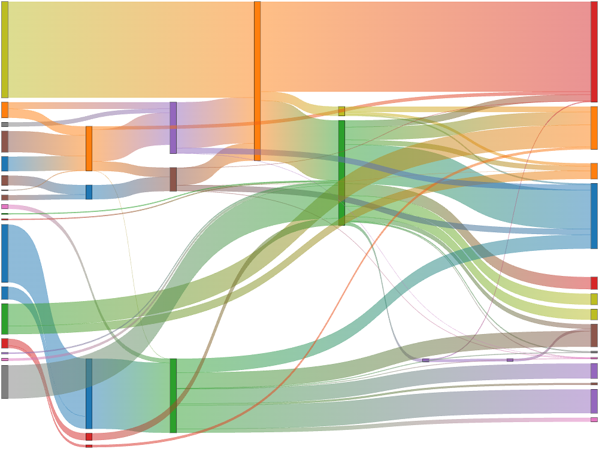

# chartjs-chart-sankey

[Chart.js](https://www.chartjs.org/) **^3.3** module for creating sankey diagrams


[](https://sonarcloud.io/summary/new_code?id=kurkle_chartjs-chart-sankey)
[](https://sonarcloud.io/summary/new_code?id=kurkle_chartjs-chart-sankey)
[](https://www.npmjs.com/package/chartjs-chart-sankey)
[](https://github.com/kurkle/chartjs-chart-sankey/releases/latest)


## Browser support

All modern and up-to-date browsers are supported, including, but not limited to:

- Chrome
- Edge
- Firefox
- Safari

Internet Explorer 11 is not supported.

## Typescript

Typescript 3.x and higher is supported.

## Documentation

You can use **chartjs-chart-sankey.js** as ES module. You'll need to manually register two components

```js
import {Chart} from 'chart.js';
import {SankeyController, Flow} from 'chartjs-chart-sankey';

Chart.register(SankeyController, Flow);
```

To create a sankey chart, include chartjs-chart-sankey.js after chart.js and then create the chart by setting the `type`
attribute to `'sankey'`

```js
const chart = new Chart(ctx, {
  type: 'sankey',
  data: dataObject
});
```

## Configuration

Example:

```js
const colors = {
  a: 'red',
  b: 'green',
  c: 'blue',
  d: 'gray'
};

const getHover = (key) => colors[key];
const getColor = (key) => colors[key];

const chart = new Chart(ctx, {
  type: 'sankey',
  data: {
    datasets: [{
      label: 'My sankey',
      data: [
        {from: 'a', to: 'b', flow: 10},
        {from: 'a', to: 'c', flow: 5},
        {from: 'b', to: 'c', flow: 10},
        {from: 'd', to: 'c', flow: 7}
      ],
      colorFrom: (c) => getColor(c.dataset.data[c.dataIndex].from),
      colorTo: (c) => getColor(c.dataset.data[c.dataIndex].to),
      hoverColorFrom: (c) => getHover(c.dataset.data[c.dataIndex].from),
      hoverColorTo: (c) => getHover(c.dataset.data[c.dataIndex].to),
      colorMode: 'gradient', // or 'from' or 'to'
      /* optionally override default alpha (0.5) applied to colorFrom and colorTo */
      alpha: 1,
      /* optional labels */
      labels: {
        a: 'Label A',
        b: 'Label B',
        c: 'Label C',
        d: 'Label D'
      },
      /* optional priority */
      priority: {
        b: 1,
        d: 0
      },
      /* optional column overrides */
      column: {
        d: 1
      },
      size: 'max', // or 'min' if flow overlap is preferred
    }]
  },
});
```

### Custom data structure

Custom data structure can be used by specifying the custom data keys in `options.parsing`.
For example:

```js
const chart = new Chart(ctx, {
  type: 'sankey',
  data: {
    datasets: [
      {
        data: [
          {source: 'a', destination: 'b', value: 20},
          {source: 'c', destination: 'd', value: 10},
          {source: 'c', destination: 'e', value: 5},
        ],
        colorFrom: 'red',
        colorTo: 'green'
      }
    ]
  },
  options: {
    parsing: {
      from: 'source',
      to: 'destination',
      flow: 'value'
    }
  }
});
```

## Example



## Online examples

[codepen](https://codepen.io/kurkle/pen/bGVKPOM)
[Vue.js 2](https://codesandbox.io/s/reverent-boyd-od2fr?file=/src/App.vue)

## Development

You first need to install node dependencies  (requires [Node.js](https://nodejs.org/)):

```bash
> npm install
```

The following commands will then be available from the repository root:

```bash
> npm run build         // build dist files
> npm run autobuild     // build and watch for changes
> npm test              // run all tests
> npm autotest          // run all tests and watch for changes
> npm lint              // perform code linting
> npm package           // create an archive with dist files and samples
```

## License

chartjs-chart-sankey is available under the [MIT license](https://opensource.org/licenses/MIT).
