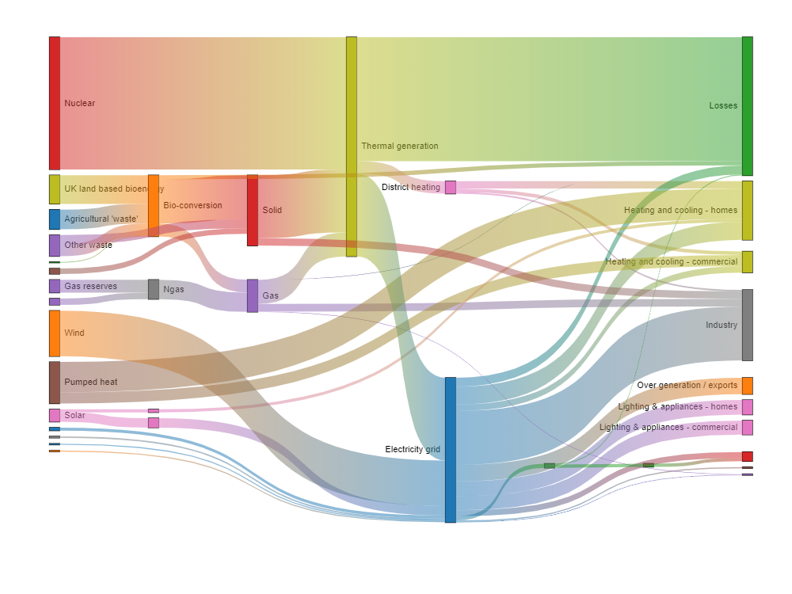

# chartjs-chart-sankey

[Chart.js](https://www.chartjs.org/) **v3.0.0-beta.3** module for creating sankey diagrams

[](https://www.npmjs.com/package/chartjs-chart-sankey) [](https://github.com/kurkle/chartjs-chart-sankey/releases/latest)   

## Documentation

To create a sankey chart, include chartjs-chart-sankey.js after chart.js and then create the chart by setting the `type` attribute to `'sankey'`

```js
new Chart(ctx, {
    type: 'sankey',
    data: dataObject
});
```

## Configuration

Example:

```js
new Chart(ctx, {
    type: 'sankey',
    data: {
        datasets: [{
            label: 'My sankey',
            data: [
                { from: 'a', to: 'b', flow: 10 },
                { from: 'a', to: 'c', flow: 5},
                { from: 'b', to: 'c', flow: 10 }
            ],
            colorFrom: (c) => getColor(c.dataset.data[c.dataIndex].from),
            colorTo: (c) => getColor(c.dataset.data[c.dataIndex].to),
        }]
    },
});
```

## Example



## Online examples

[codepen](https://codepen.io/kurkle/pen/bGVKPOM)
[Vue.js 2](https://codesandbox.io/s/reverent-boyd-od2fr?file=/src/App.vue)

## Development

You first need to install node dependencies  (requires [Node.js](https://nodejs.org/)):

```bash
> npm install
```

The following commands will then be available from the repository root:

```bash
> npm run build         // build dist files
> npm run autobuild     // build and watch for changes
> npm test              // run all tests
> npm autotest          // run all tests and watch for changes
> npm lint              // perform code linting
> npm package           // create an archive with dist files and samples
```

## License

chartjs-chart-sankey is available under the [MIT license](https://opensource.org/licenses/MIT).
