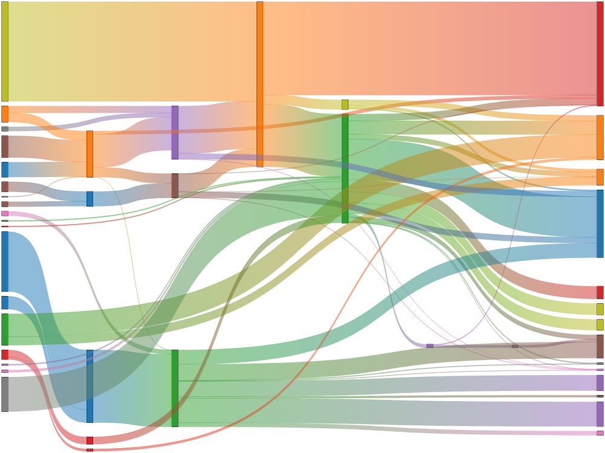

# chartjs-chart-sankey

[](https://www.npmjs.com/package/chartjs-chart-sankey)
[](https://github.com/kurkle/chartjs-chart-sankey/releases/latest)

[](https://sonarcloud.io/summary/new_code?id=kurkle_chartjs-chart-sankey)
[](https://sonarcloud.io/summary/new_code?id=kurkle_chartjs-chart-sankey)
[](https://chartjs-chart-sankey.pages.dev)


[Chart.js](https://www.chartjs.org/) **v3.3+, v4+** module that adds a sankey chart type, drawing flows between named nodes as directional bands whose width is proportional to the flow value — useful for visualizing energy transfers, budgets, funnels, and other flow-style data, for anyone already charting with Chart.js.

## Example



## Installation

```bash
npm install chartjs-chart-sankey
```

Or via CDN:

```html
<script src="https://cdn.jsdelivr.net/npm/chart.js"></script>
<script src="https://cdn.jsdelivr.net/npm/chartjs-chart-sankey"></script>
```

## Quickstart

```js
import { Chart, LinearScale } from 'chart.js';
import { Flow, SankeyController } from 'chartjs-chart-sankey';

Chart.register(LinearScale, SankeyController, Flow);

new Chart(document.getElementById('chart'), {
  type: 'sankey',
  data: {
    datasets: [
      {
        label: 'My sankey',
        data: [
          {from: 'a', to: 'b', flow: 10},
          {from: 'a', to: 'c', flow: 5},
          {from: 'b', to: 'd', flow: 6},
          {from: 'c', to: 'd', flow: 4},
        ],
      },
    ],
  },
});
```

See more integration options (script tag, other module loaders) in the [documentation](https://chartjs-chart-sankey.pages.dev/integration/).

## Documentation

You can find documentation for chartjs-chart-sankey at [https://chartjs-chart-sankey.pages.dev/](https://chartjs-chart-sankey.pages.dev/). The full dataset and options reference lives there, not in this README — this file stays a quickstart.

## Development

You first need to install node dependencies (requires [Node.js](https://nodejs.org/)):

```bash
> npm install
```

The following commands will then be available from the repository root:

```bash
> npm run build        // build dist files
> npm run autobuild     // build and watch for changes
> npm test              // run all tests
> npm run lint          // perform code linting
```

## License

chartjs-chart-sankey is available under the [MIT license](https://opensource.org/licenses/MIT).
